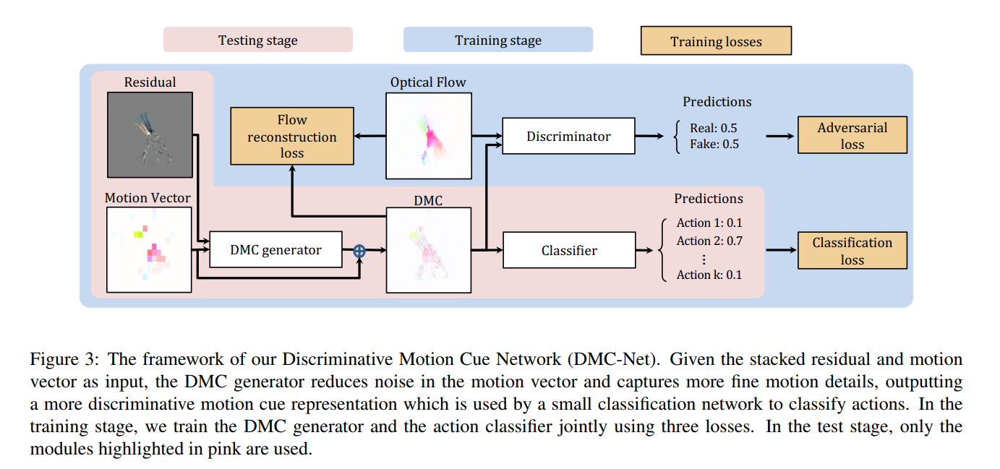
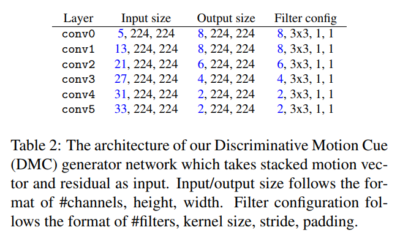

# DMC-Net: Generating Discriminative Motion Cues for Fast Compressed Video Action Recognition

paper: [<https://arxiv.org/pdf/1901.03460.pdf>]

code: [<https://github.com/facebookresearch/dmc-net>]

## Important Concepts:

1.   **Motion** in video: represented by optical **flow**: explicitly model the displacement at each pixel between successive frames (keeps the full resolution of the corresponding frame)(CNN can estimate)
2.   **Residual**: the difference between the raw RGB image and its reference frame warped by motion vector, often well-aligned with the boundary of motion object, which is important in action recognition
3.   RGB image of I-frame(**I**)(3, H, W), low-resolution Motion Vector(**MV**)( displacement of each macroblock in a P-frame typically divided into 16x16 macroblocks, values within the same macroblock are identical)(2, H, W), Residual(**R**)(3, H, W)

## Key Idea:

1.   Refining the noisy and coarse motion vector to approximate optical flow

2.   Operate exclusively in the compressed domain at inference time without requiring optical flow estimation

3.   **When properly exploited, the compressed video modalities have enough signal to allow us to capture more discriminaitve motion representation**

4.   **DMC Generator**: *Object1: approximate optical flow*, *Object2:learn motion cues that are discriminative for recognition*

     

     1.    Stack MV and R as input into the DMC generator --> allows utilizing the motion information in MV and R as well as the correlation between them

     2.    Network structure: PWC-Net(decoded RGB frame)-based(flow estimator network) --> less filters and shortcut connection

          

          Each convolution later except conv5 is followed by a Leaky ReLU layer, where the negative slope is 0.1

5.    **Flow-guided, Discriminative Motion Cues:**

      1.    Optical Flow Reconstruction Loss: *get guidance from optical flow*
      2.    Adversarial Loss: *get guidance from optical flow*
      3.    Downstream classification Loss: *get guidance from task object*

## Problem definition:

1.   Reduce noises in the motion vectors and captures fine motion details, achieving a more **Discriminative Motion Cue (DMC)** representation
2.   Approximate flow
3.   Action recognition 
4.  Motion representation learning

## Precessed Work:

1.   Directly leverage the motion vectors and residuals readily available in the compressed video  --> motion vector is noisy and has substantially reduced resolution

2.   Extracting optical flow --> very slow and often dominates the overall processing time of video analysis tasks

3.   **CoViAR**: three independent CNNs operating over three modalities in the compressed video

    --> Motion vector is less informative and discriminative than flow:

    1.   Motion vector in compressed video is low-resolution
    2.   Motion vector and residuals have strong interaction 
    
4.  From optical flow to discriminative motion cue: accuracy of optical flow does not strongly correlate with accuracy of video recognition

5.  The motion nearby object boundary is more important than the motion at other locations for action recognition

## Metrix gain:

**Benchmarks**: *HMDB-51*, *UCF-101*, a subset of *Kinetics*

1.   Generator network runs **two orders of magnitude faster** than estimating flow
2.   Much faster than SoTA motion representation learning methods

## Challenge:

1.  ~~Will attention method work in the DMC Generator?~~