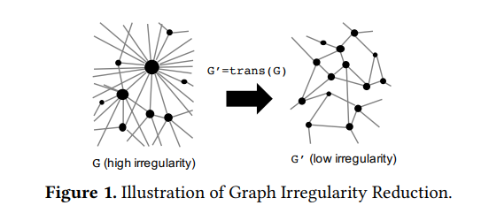
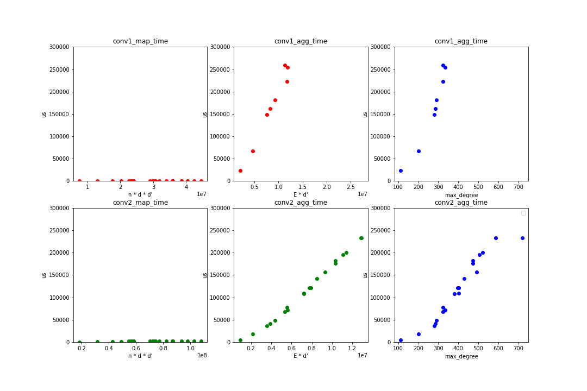
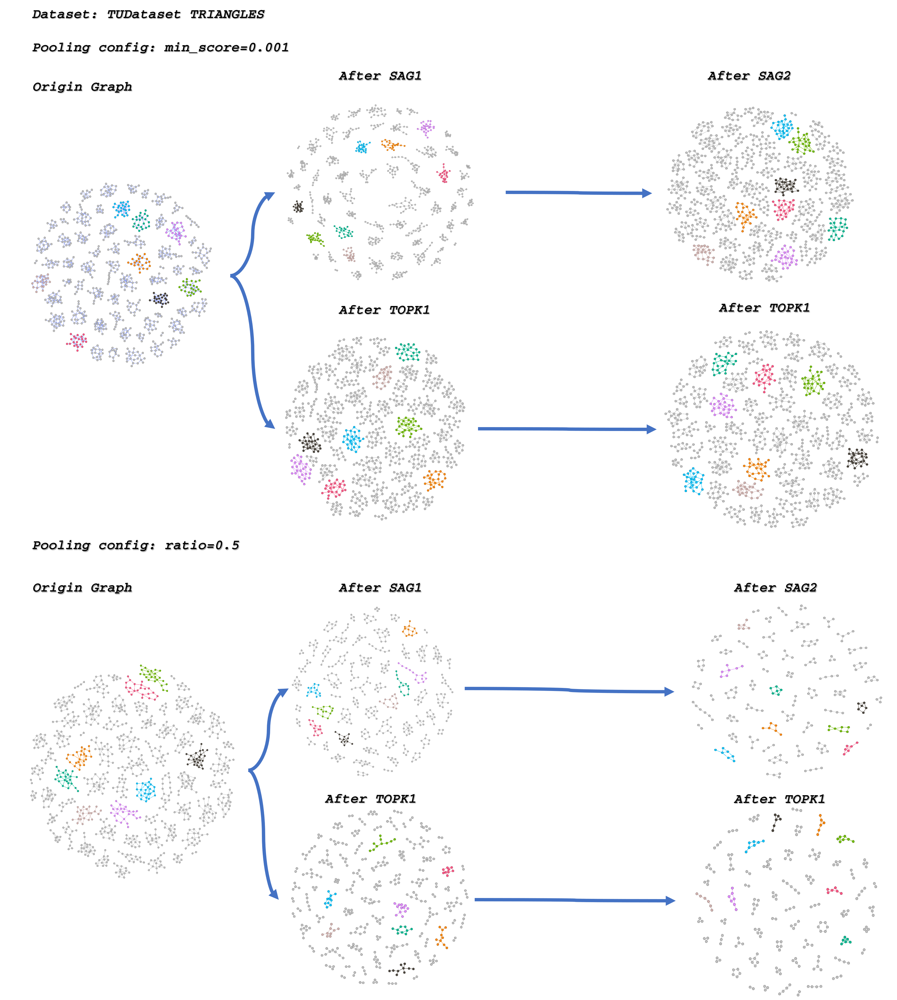
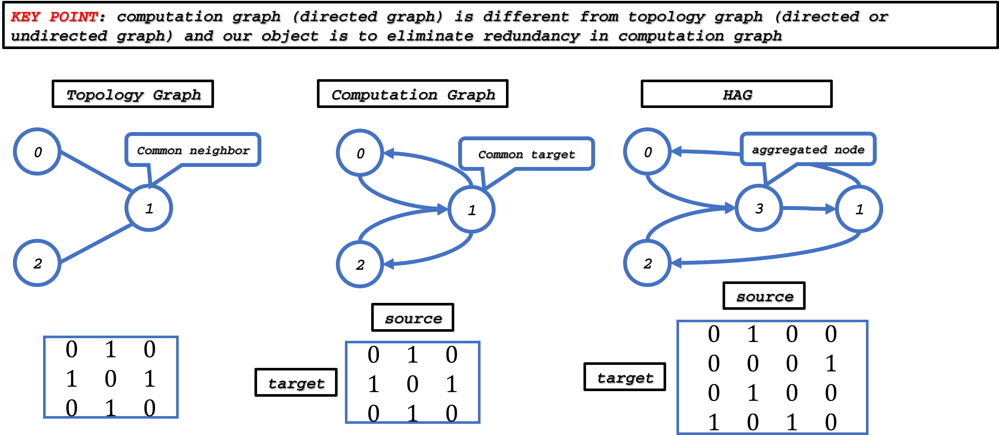
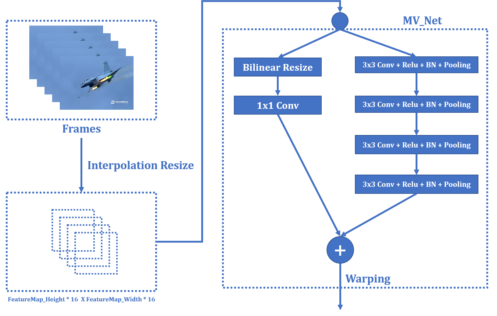
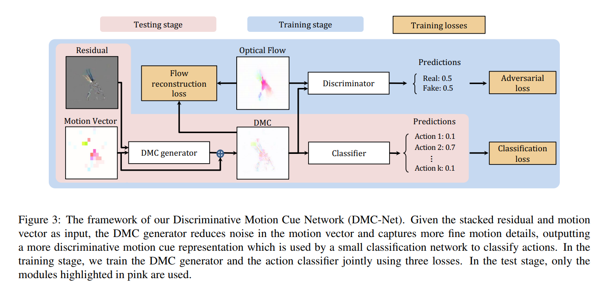
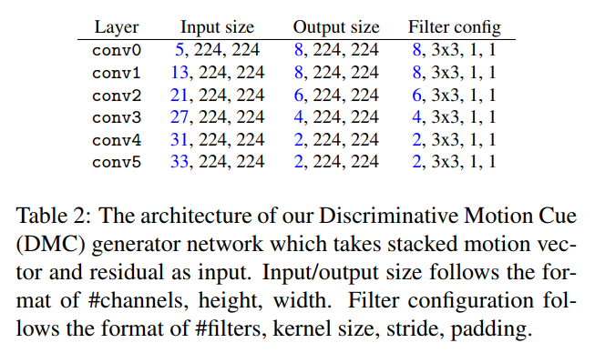

# Table of Contents
------------------

   * [Introduction](#introduction)
   * [Graph Neural Network Survey](#graph-neural-network-survey)
      * [Background](#background)
         * [Origin GNN](#origin-gnn)
         * [From spectral to propagation: Graph Convolutional Network (GCN)](#from-spectral-to-propagation-graph-convolutional-network-gcn)
         * [Why GNN from CNN](#why-gnn-from-cnn)
      * [Models](#models)
      * [System View Optimization](#system-view-optimization)
      * [General Model Project: PyTorch Geometric](#general-model-project-pytorch-geometric)
      * [Hierarchically Aggregated computation Graphs (HAGs)](#hierarchically-aggregated-computation-graphs-hags)
         * [Paper reading and Key idea](#paper-reading-and-key-idea)
         * [Reimplementation](#reimplementation)
   * [Motion-Vector based video Object Detection](#motion-vector-based-video-object-detection)
      * [Tasks](#tasks)
         * [Proof of mathmatical principal of DFF](#proof-of-mathmatical-principal-of-dff)
         * [Motion Vector Feature Flow Version3](#motion-vector-feature-flow-version3)
            * [Idea](#idea)
            * [Result and Discussion](#result-and-discussion)
         * [Motion Vector Feature Flow Version4](#motion-vector-feature-flow-version4)
            * [Idea](#idea-1)
            * [Result and Discussion](#result-and-discussion-1)
         * [Motion Vector Output Flow Step-Performance Curve](#motion-vector-output-flow-step-performance-curve)
   * [Quantum Computing Learning](#quantum-computing-learning)
      * [First stage: From bits to qubits: Basical Concepts and Algorithm of Quantum Computing](#first-stage-from-bits-to-qubits-basical-concepts-and-algorithm-of-quantum-computing)
         * [What Is a QPU?](#what-is-a-qpu)
         * [Native QPU Instructions](#native-qpu-instructions)
         * [Simulator Limitations](#simulator-limitations)
         * [QPU Versus GPU:](#qpu-versus-gpu)
      * [<del>Second stage: Great idea evolution and Important Works</del>](#second-stage-great-idea-evolution-and-important-works)
      * [<del>Third stage: On-going Front Problem and Research</del>](#third-stage-on-going-front-problem-and-research)
      * [<del>Fourth stage: Research directions</del>](#fourth-stage-research-directions)

# Introduction

This is a repository of Jingtun ZHANG’s 2019 summer intern @[University of California Santa Barbara](https://ucsb.edu)

>   Paper reading note can be found at [Github link](https://github.com/OrdinaryCrazy/cnn-compiler-notebook/tree/master/paper-reading-note)
>
>   Studying note can be found at [Github link](https://github.com/OrdinaryCrazy/cnn-compiler-notebook/tree/master/Studying%20Note)
>
>   Weekly report can be found at [Github link](https://github.com/OrdinaryCrazy/cnn-compiler-notebook/tree/master/weekly-report)

# Graph Neural Network Survey

## Background

### Origin GNN

**Target problem**: learn a state embedding  for each node

**Traditional procedure**:

 means neighbors of ,  is local parameterized transition function

 is local output function

**Typical loss**:

Details can be found at [Github link](https://github.com/OrdinaryCrazy/cnn-compiler-notebook/blob/master/Studying%20Note/README.md)

### From spectral to propagation: Graph Convolutional Network (GCN)

** can be well-approximated by a truncated expansion in terms of Chebyshev polynomials  up to  order:** 

1.  ,  denotes the largest eigenvalue of 
2.  : vector of Chebyshev coefficients
3.  
4.  SO: 
1.    
2.   polynomial in the Laplacian: it depends only on nodes that are at maximum K steps away from the cantral node
3.  with  and :

with  and renormalization trick 
from C input channelsand F filters:
: complexity:
1. : matrix of filter parameters
2. : convolved signal matrix

**Layer-wise propagation rule:**

: adjacency matrix with added self connection

:

: layer-specific trainable weight matrix

:  activation function

: the matirx of activations in the  layer, 

Details can be found at [Github link](https://github.com/OrdinaryCrazy/cnn-compiler-notebook/blob/master/Studying%20Note/GCN.md)

###  Why GNN from CNN

1.   Graphs are the most typical locally connected structure
2.   Share weights reduce the computational cost compared with traditional spectral graph theory
3.   Multilayer structure is the key to deal with hierarchical patterns, which captures the featuofres of various sizes
4.   CNNs or RNNs need a specific order, but there is no natural order of nodes in graph, GNNs output is input order invarient
5.   Human intelligencce is most based on the graph, GNNs can do information propagation guided by the graph structure
6.   GNNs explores to generate the graph from non-structural data

## Models

+   GDyNet and CGCNN model: Application of GNN in materials. Details can be found at [Github link](https://github.com/OrdinaryCrazy/cnn-compiler-notebook/blob/master/weekly-report/weeklyreport0722-0728.pdf)

## System View Optimization

+   Tigr

    **T**ransform **i**rregular **g**raphs into more **r**egular ones such that the graphs can be processed more efficiently on GPU-like architectures while guaranteeing correctness.
    
    
    Details can be found at [Github link](https://github.com/OrdinaryCrazy/cnn-compiler-notebook/blob/master/Studying%20Note/tigr.md)
    
+ Fast train GNN on dense hardware

    Permute nodes to expose low bandwidth structure and express GNN propagation in terms of application of dense matrix multiply primitive.

    Details can be found at [Github link](https://github.com/OrdinaryCrazy/cnn-compiler-notebook/blob/master/paper-reading-note/fast-training%20of%20sparse%20gnn%20on%20dense%20hardware.pdf)
## General Model Project: PyTorch Geometric

Github Project [rusty1s/pytorch_geometric](https://github.com/rusty1s/pytorch_geometric) implements many important GNN models with general GNN model Message Passing Neural Network, and builds an end-to-end graph data loading to testing model architecture. Detail studying note can be found at [Github Link](https://github.com/OrdinaryCrazy/cnn-compiler-notebook/blob/master/Studying%20Note/learn-pytorch-geometric.md)

I modified this project for the following research: Code can be found at [Github Link](https://github.com/OrdinaryCrazy/cnn-compiler-notebook/tree/master/pytorch_geometric)

+   Profiling of GNN models

    Complexity analysis of MPNN network

    Details can be found at [Github link](https://github.com/OrdinaryCrazy/cnn-compiler-notebook/blob/master/weekly-report/weeklyreport0722-0728.pdf)

+   Visualization of Pooling effectiveness

    In topology domain: **Less nodes**
    
    
    
    In embedding domain: **Maintenance of group structure and similarity**
    
    
    
    Details can be found at [Github link](https://github.com/OrdinaryCrazy/cnn-compiler-notebook/blob/master/GNN-jupyter-code/topk-pooling%20visualization.ipynb)

## Hierarchically Aggregated computation Graphs (HAGs)

### Paper reading and Key idea

Represent common neighbors across different nodes using aggregation hierarchies, which eliminates redundant computation and unnecessary data transfers in both GNN training and inference.

Problems:

+   Maybe Not Optimal, But No Better Idea

+   Did not release code or details the heap maintenance method

+   More Discussion:

    1.  Understanding of the model: 

        Details can be found at [Github link](https://github.com/OrdinaryCrazy/cnn-compiler-notebook/blob/master/weekly-report/weeklyreport0722-0728.pdf)

        
    
    2.  Detailed description about max redundancy computation: 
    
        Details can be found at [Github link](https://github.com/OrdinaryCrazy/cnn-compiler-notebook/blob/master/weekly-report/weeklyreport0729-0804.pdf)
    
    

### Reimplementation

Release [HAG model Version 0.0](https://github.com/OrdinaryCrazy/cnn-compiler-notebook/blob/master/GNN-jupyter-code/HAG.py)

More details can be found at [Tutorial](https://github.com/OrdinaryCrazy/cnn-compiler-notebook/blob/master/weekly-report/weeklyreport0729-0804.pdf) and [Github build](https://github.com/OrdinaryCrazy/cnn-compiler-notebook/tree/master/HAG)

# Motion-Vector based video Object Detection

## Tasks

### Proof of mathmatical principal of DFF

We try to proof the existence of a linear transformation that maps the feature map of key frame to the feature map of non-key frames based on the motion information:

>   Given a convolution operation ,  frame  and , as well as the corresponding feature maps  and ,  a linear transformation , such that , where , where  and  are motion and error information extracted from motion vector and residual map respectively.

And the error term of residual map will not explode after a sequence of convolution operations:

>   Given a convolution operation  with unit normality and an error information , the error information  after convolution operation enjoys convolution-invariance, *i.e.*, .

Details can be found at [Github link](https://github.com/OrdinaryCrazy/cnn-compiler-notebook/blob/master/weekly-report/Rivulet_Proof.pdf)

### Motion Vector Feature Flow Version3

#### Idea

Rather than just scale the motion vector by 1x1 Convolutional Layer, we try to build a more complicated MV_Net try to improve the quality of motion vector used at feature map level. MV_Net is piced as following:

#### Result and Discussion

We get MAP@5 = 0.6225 with above MV_Net architecture, some points we discussed in the design:

*   MVFF-Object-Detection task is sensitive to the information loss in integer-times scale and width-height-same-ratio scale of movtion vector in pooling process, so we need firstly use interpolation (non-integer-times) scale to scale the movtion vector to a integer-times of
    feature map shape (16\*feat-map-width, 16*feat-map-height)

    Details can be found at [Github link](https://github.com/OrdinaryCrazy/cnn-compiler-notebook/blob/master/weekly-report/weeklyreport0819-0825.pdf)

Code find at [MVFF-Version3](https://github.com/OrdinaryCrazy/mvff-sideversions) 

File organization same as [Deep Feature Flow for Video Recognition](https://github.com/msracver/Deep-Feature-Flow)

### Motion Vector Feature Flow Version4

#### Idea

Use DMC-Net like structure to fine-tune the motion vector, try to gain more motion information form residual data under optical flow guidence.

DMC-Net details can be found at [Github Link]([https://github.com/OrdinaryCrazy/cnn-compiler-notebook/blob/master/Studying%20Note/DMC-Net.md](https://github.com/OrdinaryCrazy/cnn-compiler-notebook/blob/master/Studying Note/DMC-Net.md))

#### Result and Discussion

Result of MVFF-Version4-without optical flow guidence: MAP@5 = 0.5091.

Maybe we need extract optical flow from the dataset first.

Code find at [MVFF-Version4](https://github.com/OrdinaryCrazy/mvff-sideversions/tree/master/Version4) 

### Motion Vector Output Flow Step-Performance Curve

We tried different steps of MVOF to approximate the result of DFF and accelerate it, trying to analyse motion vector propagation at output level.

# Quantum Computing Learning

## First stage: From bits to qubits: Basical Concepts and Algorithm of Quantum Computing

### What Is a QPU? 

*   QPU (Quantum Processing Unit) is a co-processor 

*   QPU has ability to dramatically extend the kinds of problems that are tractable within computing. 

*   The CPU issues the QPU co-processor commands only to initiate tasks suited to its capabilities.

### Native QPU Instructions 

*   Conventional high-level languages are commonly used to control lower-level QPU instructions. 

*   Essential QPU instruction set 

### Simulator Limitations 

*   One measure of the power of a QPU is the number of qubits it has available to operate on. 

*   Each qubit added to simulation will double the memory required to run the simulation, cutting its speed in half.

### QPU Versus GPU: 

Some Common Characteristics What it’s like to program a QPU:
*   It is very rare that a program will run entirely on a QPU. Usually, a program runnning on a CPU will issue QPU instructions, and later retrieve the results.
*   Some tasks are very suited to the QPU, and others are not.
*   The QPU runs on a separate clock from the CPU, and usually has its own dedicated hardware interfaces to external devices (such as optical outputs).
*   A typical QPU has its own special RAM, which the CPU cannot efficiently access.
*   A simple QPU will be one chip accessed by a laptop, or even perhaps eventually an area within another chip. A more advanced QPU is a large and expensive addon, and always requires special cooling.
*   When a computation is done, a projection of the result is returned to the CPU, and most of the QPU’s internal working data is discarded.
*   QPU debugging can be very tricky, requiring special tools and techniques, Stepping through a program can be difficult, and often the best approcah is to make changes to the program and observe their effect on the output.
*   Optimizations that speed up one QPU may slow down another.

## ~~Second stage: Great idea evolution and Important Works~~

## ~~Third stage: On-going Front Problem and Research~~

## ~~Fourth stage: Research directions~~

