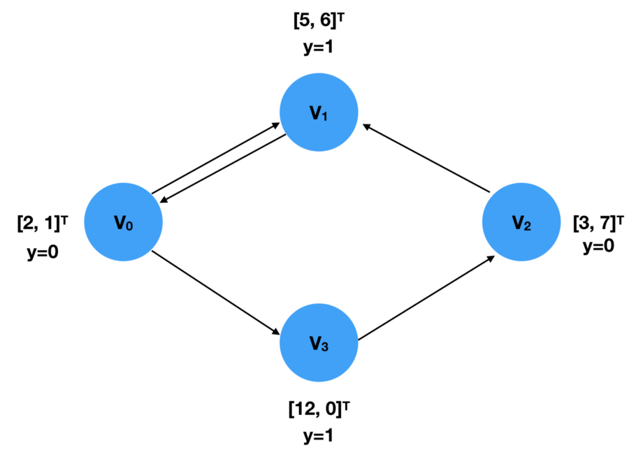

# learn-pytorch-geometric

## Installation

```bash
pip3 install --verbose --no-cache-dir torch-scatter
pip3 install --verbose --no-cache-dir torch-sparse
pip3 install --verbose --no-cache-dir torch-cluster
pip3 install --verbose --no-cache-dir torch-spline-conv
pip3 install torch-geometric
```

## Data Representation:

For Graph $$\mathcal{G} = (X,(I,E))$$

where:

1.   node feature matrix: $$X \in \mathbb{R}^{N\times F}$$
2.   sparse adjacency tuple $$(I,E)$$, $$I \in \mathbb{N}^{2\times E}$$ encodes edges in Coordinate format (COO: the first list contains the index of the source nodes, while the index of target nodes is specified in the second list.) , $$E \in \mathbb{R}^{E \times D}$$ holds D-dimensional edge features

## Neighborhood Aggregation


$$
\vec{x}'_{i} = \gamma\left(\vec{x}_{i}, {AS\atop{j \in \mathcal{N(i)}}}\phi(\vec{x}_{i},\vec{x}_{j},\vec{e}_{i,j})\right)
$$

where:

1.  $${AS\atop i \in \mathcal{N}(i)}$$: **aggregation function**, differentiable, permutation invarient
2.  $$\gamma$$: **update function**, differentiable
3.  $$\phi$$: **message function**, differentiable

## How to load data set?

### PyG Graph Data Structure: `torch_geometric.data.Data`



*  `data.x`: node feature matrix

```python
x = torch.tensor([[2,1], [5,6], [3,7], [12,0]], dtype=torch.float)
```

*   `data.edge_index`: $$I$$

```python
edge_index = torch.tensor([[0, 1, 2, 0, 3],
                           [1, 0, 1, 3, 2]], dtype=torch.long)
```


*   `data.edge_attr`: edge feature matrix
*   `data.y`: train target

```python
y = torch.tensor([0, 1, 0, 1], dtype=torch.float)
```


*   `data.pos`: data position matrix

## How to build a graph?

```python
import torch
from torch_geometric.data import Data

x = torch.tensor([[2,1], [5,6], [3,7], [12,0]], dtype=torch.float)
y = torch.tensor([0, 1, 0, 1], dtype=torch.float)

edge_index = torch.tensor([[0, 2, 1, 0, 3],
                           [3, 1, 0, 1, 2]], dtype=torch.long)

data = Data(x=x, y=y, edge_index=edge_index)
```

## How to build Graph DataSet

Example: PPI DataSet

```python
from itertools import product
import os
import os.path as osp
import json

import torch
import numpy as np
import networkx as nx
from networkx.readwrite import json_graph
from torch_geometric.data import (InMemoryDataset, Data, download_url, extract_zip)
from torch_geometric.utils import remove_self_loops

class PPI(InMemoryDataset):
    r"""The protein-protein interaction networks from the `"Predicting
    Multicellular Function through Multi-layer Tissue Networks"
    <https://arxiv.org/abs/1707.04638>`_ paper, containing positional gene
    sets, motif gene sets and immunological signatures as features (50 in
    total) and gene ontology sets as labels (121 in total).

    Args:
        数据集根文件夹
        root (string): Root directory where the dataset should be saved.
        数据集参数
        split (string): 
            If :obj:`"train"`, loads the training dataset.
            If :obj:`"val"`, loads the validation dataset.
            If :obj:`"test"`, loads the test dataset. (default: :obj:`"train"`)
        转换函数
        transform (callable, optional): A function/transform that takes in an
            :obj:`torch_geometric.data.Data` object and returns a transformed
            version. The data object will be transformed before every access.
            (default: :obj:`None`)
        保存格式
        pre_transform (callable, optional): A function/transform that takes in
            an :obj:`torch_geometric.data.Data` object and returns a
            transformed version. The data object will be transformed before
            being saved to disk. (default: :obj:`None`)
        判断是否要保留到最后使用
        pre_filter (callable, optional): A function that takes in an
            :obj:`torch_geometric.data.Data` object and returns a boolean
            value, indicating whether the data object should be included in the
            final dataset. (default: :obj:`None`)
    """

    url = 'https://s3.us-east-2.amazonaws.com/dgl.ai/dataset/ppi.zip'

    def __init__(self,
                 root,
                 split='train',
                 transform=None,
                 pre_transform=None,
                 pre_filter=None):

        assert split in ['train', 'val', 'test']

        super(PPI, self).__init__(root, transform, pre_transform, pre_filter)

        if split == 'train':
            self.data, self.slices = torch.load(self.processed_paths[0])
        elif split == 'val':
            self.data, self.slices = torch.load(self.processed_paths[1])
        elif split == 'test':
            self.data, self.slices = torch.load(self.processed_paths[2])

    @property
    def raw_file_names(self):
        '''
        			It returns a list that shows a list of raw, unprocessed file names.
        '''
        splits = ['train', 'valid', 'test']
        files  = ['feats.npy', 'graph_id.npy', 'graph.json', 'labels.npy']
        return ['{}_{}'.format(s, f) for s, f in product(splits, files)]

    @property
    def processed_file_names(self):
        '''
        		 returns a list containing the file names of all the processed data. 
        		 After process() is called, Usually, the returned list should only have one element, 
        		 storing the only processed data file name.
        '''
        return ['train.pt', 'val.pt', 'test.pt']

    def download(self):
        '''
        			This function should download the data you are working on to 
        			the directory as specified in self.raw_dir.
        '''
        path = download_url(self.url, self.root)
        extract_zip(path, self.raw_dir)
        os.unlink(path)

    def process(self):
        '''
        			You need to gather your data into a list of Data objects. 
        			Then, call self.collate() to compute the slices that will be used by the DataLoader object. 
        '''
        for s, split in enumerate(['train', 'valid', 'test']):
            path = osp.join(self.raw_dir, '{}_graph.json').format(split)
            with open(path, 'r') as f:
                G = nx.DiGraph(json_graph.node_link_graph(json.load(f)))

            x = np.load(osp.join(self.raw_dir, '{}_feats.npy' ).format(split))
            x = torch.from_numpy(x).to(torch.float)

            y = np.load(osp.join(self.raw_dir, '{}_labels.npy').format(split))
            y = torch.from_numpy(y).to(torch.float)

            data_list = []
            path = osp.join(self.raw_dir, '{}_graph_id.npy').format(split)
            idx = torch.from_numpy(np.load(path)).to(torch.long)
            idx = idx - idx.min()

            for i in range(idx.max().item() + 1):
                mask = idx == i

                G_s = G.subgraph(mask.nonzero().view(-1).tolist())
                edge_index = torch.tensor(list(G_s.edges)).t().contiguous()
                edge_index = edge_index - edge_index.min()
                edge_index, _ = remove_self_loops(edge_index)

                data = Data(edge_index=edge_index, x=x[mask], y=y[mask])

                if self.pre_filter is not None and not self.pre_filter(data):
                    continue

                if self.pre_transform is not None:
                    data = self.pre_transform(data)

                data_list.append(data)
            torch.save(self.collate(data_list), self.processed_paths[s])
```

## DataLoader

The DataLoader class allows you to feed data by batch into the model effortlessly. To create a DataLoader object, you simply specify the Dataset and the batch size you want.

```python
loader = DataLoader(dataset, batch_size=512, shuffle=True)
```

Every iteration of a DataLoader object yields a Batch object, which is very much like a Data object but with an attribute, “batch”. It indicates which graph each node is associated with. Since a DataLoader aggregates *x*, *y*, and *edge_index* from different samples/ graphs into Batches, the GNN model needs this “batch” information to know which nodes belong to the same graph within a batch to perform computation.

```python
for batch in loader:
    batch
    >>> Batch(x=[1024, 21], edge_index=[2, 1568], y=[512], batch=[1024])
```

## MessagePassing / Neighborhood Aggregation

#### `propagate(edge_index, size=None, **kwargs):`

It takes in edge index and other optional information, such as node features (embedding). Calling this function will consequently call *message* and *update*.

#### `message(**kwargs):`

construct “message” for each of the node pair $$(x_i, x_j)$$

#### `update(aggr_out,**kwargs):`

It takes in the aggregated message and other arguments passed into *propagate*, assigning a new embedding value for each node.

Example:

```python
import torch
from torch.nn import Sequential as Seq, Linear, ReLU
from torch_geometric.nn import MessagePassing
from torch_geometric.utils import remove_self_loops, add_self_loops
class SAGEConv(MessagePassing):
    def __init__(self, in_channels, out_channels):
        super(SAGEConv, self).__init__(aggr='max') #  "Max" aggregation.
        self.lin = torch.nn.Linear(in_channels, out_channels)
        self.act = torch.nn.ReLU()
        self.update_lin = torch.nn.Linear(in_channels + out_channels, in_channels, bias=False)
        self.update_act = torch.nn.ReLU()
        
    def forward(self, x, edge_index):
        # x has shape [N, in_channels]
        # edge_index has shape [2, E]
        
        
        edge_index, _ = remove_self_loops(edge_index)
        edge_index, _ = add_self_loops(edge_index, num_nodes=x.size(0))
        
        
        return self.propagate(edge_index, size=(x.size(0), x.size(0)), x=x)

    def message(self, x_j):
        # x_j has shape [E, in_channels]

        x_j = self.lin(x_j)
        x_j = self.act(x_j)
        
        return x_j

    def update(self, aggr_out, x):
        # aggr_out has shape [N, out_channels]


        new_embedding = torch.cat([aggr_out, x], dim=1)
        
        new_embedding = self.update_lin(new_embedding)
        new_embedding = self.update_act(new_embedding)
        
        return new_embedding
```

## Build a Graph Neural Network

```python
embed_dim = 128
from torch_geometric.nn import TopKPooling
from torch_geometric.nn import global_mean_pool as gap, global_max_pool as gmp
import torch.nn.functional as F
class Net(torch.nn.Module):
    def __init__(self):
        super(Net, self).__init__()

        self.conv1 = SAGEConv(embed_dim, 128)
        self.pool1 = TopKPooling(128, ratio=0.8)
        self.conv2 = SAGEConv(128, 128)
        self.pool2 = TopKPooling(128, ratio=0.8)
        self.conv3 = SAGEConv(128, 128)
        self.pool3 = TopKPooling(128, ratio=0.8)
        self.item_embedding = torch.nn.Embedding(num_embeddings=df.item_id.max() +1, embedding_dim=embed_dim)
        self.lin1 = torch.nn.Linear(256, 128)
        self.lin2 = torch.nn.Linear(128, 64)
        self.lin3 = torch.nn.Linear(64, 1)
        self.bn1 = torch.nn.BatchNorm1d(128)
        self.bn2 = torch.nn.BatchNorm1d(64)
        self.act1 = torch.nn.ReLU()
        self.act2 = torch.nn.ReLU()        
    def forward(self, data):
        x, edge_index, batch = data.x, data.edge_index, data.batch
        x = self.item_embedding(x)
        x = x.squeeze(1)        

        x = F.relu(self.conv1(x, edge_index))

        x, edge_index, _, batch, _ = self.pool1(x, edge_index, None, batch)
        x1 = torch.cat([gmp(x, batch), gap(x, batch)], dim=1)

        x = F.relu(self.conv2(x, edge_index))
        
        x, edge_index, _, batch, _ = self.pool2(x, edge_index, None, batch)
        x2 = torch.cat([gmp(x, batch), gap(x, batch)], dim=1)

        x = F.relu(self.conv3(x, edge_index))

        x, edge_index, _, batch, _ = self.pool3(x, edge_index, None, batch)
        x3 = torch.cat([gmp(x, batch), gap(x, batch)], dim=1)

        x = x1 + x2 + x3

        x = self.lin1(x)
        x = self.act1(x)
        x = self.lin2(x)
        x = self.act2(x)      
        x = F.dropout(x, p=0.5, training=self.training)

        x = torch.sigmoid(self.lin3(x)).squeeze(1)

        return x
```

### Train

```python
def train():
    model.train()

    loss_all = 0
    for data in train_loader:
        data = data.to(device)
        optimizer.zero_grad()
        output = model(data)
        label = data.y.to(device)
        loss = crit(output, label)
        loss.backward()
        loss_all += data.num_graphs * loss.item()
        optimizer.step()
    return loss_all / len(train_dataset)
    
device = torch.device('cuda')
model = Net().to(device)
optimizer = torch.optim.Adam(model.parameters(), lr=0.005)
crit = torch.nn.BCELoss()
train_loader = DataLoader(train_dataset, batch_size=batch_size)
for epoch in range(num_epochs):
    train()
```

### Validation

```python
def evaluate(loader):
    model.eval()

    predictions = []
    labels = []

    with torch.no_grad():
        for data in loader:

            data = data.to(device)
            pred = model(data).detach().cpu().numpy()

            label = data.y.detach().cpu().numpy()
            predictions.append(pred)
            labels.append(label)
```

### Test

```python
for epoch in range(1):
    loss = train()
    train_acc = evaluate(train_loader)
    val_acc = evaluate(val_loader)    
    test_acc = evaluate(test_loader)
    print('Epoch: {:03d}, Loss: {:.5f}, Train Auc: {:.5f}, Val Auc: {:.5f}, Test Auc: {:.5f}'.
          format(epoch, loss, train_acc, val_acc, test_acc))for epoch in range(1):
    loss = train()
    train_acc = evaluate(train_loader)
    val_acc = evaluate(val_loader)    
    test_acc = evaluate(test_loader)
    print('Epoch: {:03d}, Loss: {:.5f}, Train Auc: {:.5f}, Val Auc: {:.5f}, Test Auc: {:.5f}'.
          format(epoch, loss, train_acc, val_acc, test_acc))
```

## Message Passing Networks

Generalizing the convolution operator to irregular domains is typically expressed as a *neighborhood aggregation* or *message passing* scheme. 

$$\mathbf{x}_i^{(k)} = \gamma^{(k)} \left( \mathbf{x}_i^{(k-1)}, \square_{j \in \mathcal{N}(i)} \, \phi^{(k)}\left(\mathbf{x}_i^{(k-1)}, \mathbf{x}_j^{(k-1)},\mathbf{e}_{i,j}\right) \right)$$

PyTorch Geometric provides the `torch_geometric.nn.MessagePassing` base class, which helps in creating such kinds of message passing graph neural networks by automatically taking care of message propagation. The user only has to define the functions *𝜙* , *i.e.* `message()`, and *𝛾*, *.i.e.*`update()`, as well as the aggregation scheme to use, *.i.e.* `aggr='add'`, `aggr='mean'` or `aggr='max'`.

*   **torch_geometric.nn.MessagePassing(aggr="add",** **flow="source_to_target")**
*   **torch_geometric.nn.MessagePassing.propagate(edge_index,** **size=None,** ***\*kwargs)**
    *   In *forward* method
*   **torch_geometric.nn.MessagePassing.message()**
*   **torch_geometric.nn.MessagePassing.update()**


