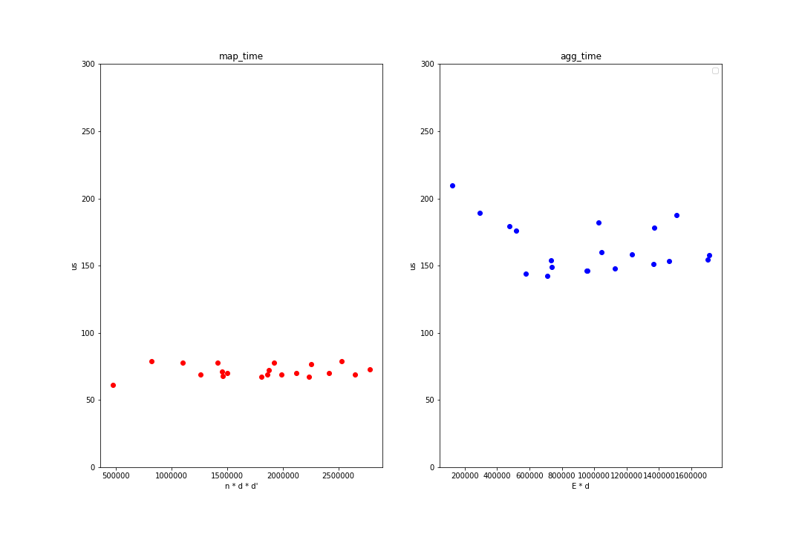

# Problem:

get the time consumption of different parts in the end to end MPNN-GNN (Graph Neural Network in Message Passing Neural Network) system:

## End to end MPNN-GNN

```shell
raw graph data ( 20KB ~ 20GB ) --> PPI: The protein-protein interaction networks from the `"Predicting Multicellular Function through Multi-layer Tissue Networks" <https://arxiv.org/abs/1707.04638>` (1.1GB)
            |
            |---- Create DataSet/InMemoryDataSet
            |
DataSet/InMemoryDataSet
            |
            |---- Create DataLoader
            |
Per Graph every Batch (3k nodes + 10w edges)
            |
            |--------------------------------------------------------------
            |                                                        |
            |-------------------------------------                   |
            |                       |                                |
         x = x * w              map_time                             |
            |                       |                                |
            |---------------------------------------------           |
            |                                |                       |
m = message(x, edge in coo format)           |                       |
            |                                |                 per_conv_layer
            |                                |                       |
       m = sum(m)                      aggregate_time                |
            |                                |                       |
            |                                |                       |
      x = update(m)                          |                       |
            |                                |                       |
            |---------------------------------------------           |
            |                                                        |
            |--------------------------------------------------------------
```

computation cost in theory


x : node embedding: node_num * channels

w : M_t parameter matrix: in_channels * out_channels


map_time = node_num * in_channels * out_channels

aggregate_time = 2 * edge_num * out_channels


But in fact: **seems graph invarient**

```python
class testNet(torch.nn.Module):
    def __init__(self):
        super(testNet, self).__init__()
        self.conv1 = GCNConv(train_dataset.num_features, 256)
        self.conv2 = GCNConv(256, train_dataset.num_classes)
    def forward(self, x, edge_index):
        x = self.conv1(x, edge_index)
        x = F.leaky_relu(x)
        x = F.dropout(x, training=intrain)
        x = self.conv2(x, edge_index)
        x = F.log_softmax(x, dim=1)
        return x
```



