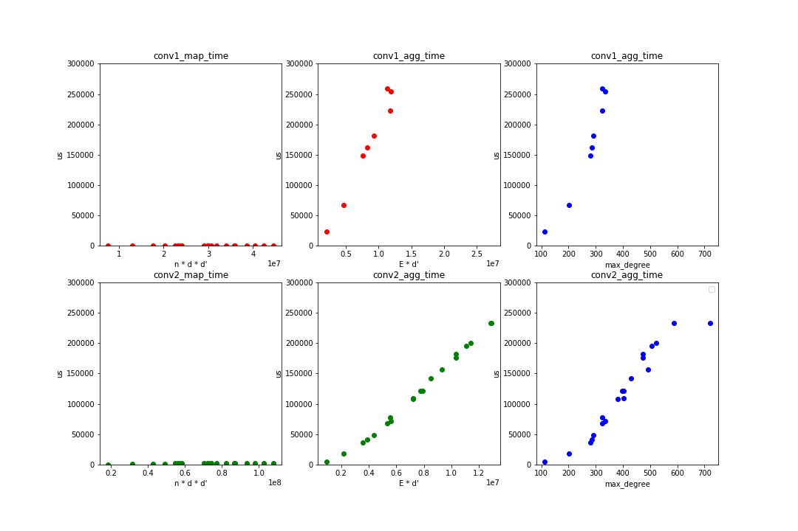

# Weekly Report 2019.07.22-2019.07.28

>   Jingtun ZHANG

## Work and Progress

1.   Reimplementation of [HAG][4]:
     
     1.    Understanding of the model:
     
          
     
     2.    Idea of redundancy computation: build node-pair heap every iteration in HAG building process --> O(VlogV)
     
     3.    Coding: in coding now...
     
2.   Reasonabe complexity analysis of MPNN network:
     1.    aggregate time is proportional to Edge in the Graph: agg_time ~ O(E)
     2.    aggregate time can be optimized by CUDA to graph invarient (graph with thousands of nodes)
     3.    mapping time complexity --> still ubreasonable --> need profiling of `tf.matmal` procedure
     
     
     
3.    [GDyNet][1] and [CGCNN][2] model: Test different pooling method in GDyNet

     1.    Paper Reading:
          1.    CGCNN: node structure --> properity --> Graph classification
          2.    GDyNet: do not understand the task in detail, from model point: Markovain Process & node embedding (for traget node) --> dynamic properity of atoms
     2.    Code reading:
          1.    CGCNN: good pytorch code and understandable
          2.    GDyNet: tensorflow.keras is not a good style --> not figure out the content of data flow and the pooling function in release code seems no pooling function

## This week plan

1.    give out a Good HAG Code

---

[1]:<https://www.nature.com/articles/s41467-019-10663-6.pdf>

[2]:https://arxiv.org/pdf/1710.10324.pdf
[3]: <https://arxiv.org/pdf/1609.02907.pdf>
[4]: https://arxiv.org/pdf/1906.03707.pdf