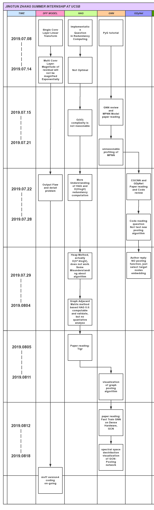

# Weekly Report 2019.08.05-2019.08.11

>   Jingtun ZHANG

**WHERE WE ARE**:

## Work and Progress
1.     Paper-reading: Tigr, [note][1]

2.    Visualization of Pooling effectiveness:

     

## This week plan

1.     paper reading for idea:
       1.      Graph data Processing
       2.      Source code analyse
       3.      GNN models
2.     experiments of pooling methods

---
[1]: https://github.com/OrdinaryCrazy/cnn-compiler-notebook/blob/master/GNN/tigr.md
[4]: https://arxiv.org/pdf/1906.03707.pdf