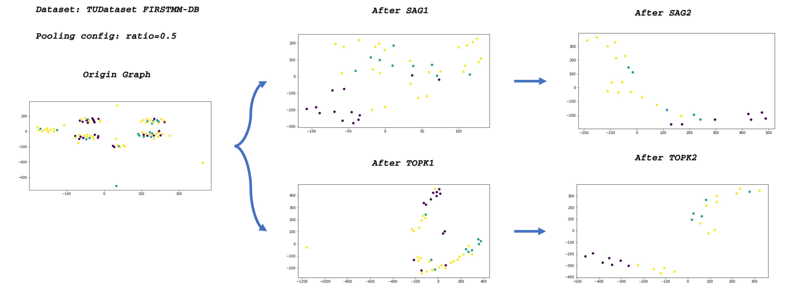

# Weekly Report 2019.08.12-2019.08.18

>   Jingtun ZHANG

**WHERE WE ARE**:

## Work and Progress
1.     Paper-reading: Fast train GNN on dense hardware, [note][1], GCN,[note][2]

2.    Visualization of Pooling effectiveness in spectral space:

     

## This week plan

1.     paper reading for idea:
       1.      Graph data Processing
       2.      Source code analyse
       3.      GNN models
2.     MVFF coding

---
[1]: https://github.com/OrdinaryCrazy/cnn-compiler-notebook/blob/master/GNN/fast-training%20of%20sparse%20gnn%20on%20dense%20hardware.md
[2]: https://github.com/OrdinaryCrazy/cnn-compiler-notebook/blob/master/GNN/GCN.md