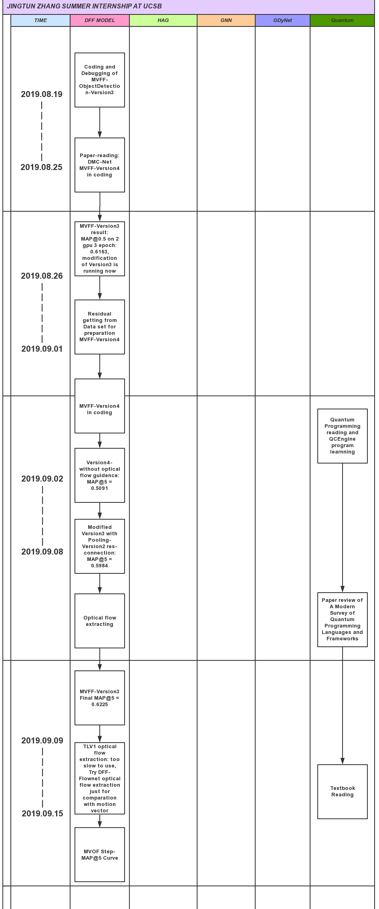

# Weekly Report 2019.09.02-2019.09.08

>   Jingtun ZHANG

**WHERE WE ARE**:

## Work and Progress
2.    :disappointed_relieved: Result of Modified MVFF-Version3: MAP@5 = 0.5984 lower than MVFF-Version2

      Discuss: 

      1.    16x16 Pooling-Version2 maybe not good, replaced by BilinearResize, running now
      
3.    :hammer_and_wrench: : Data Preparation for V4: extracting TLV1-flow from dataset (need more than one week)

4.    :disappointed_relieved: Result of MVFF-Version4-without optical flow guidence: MAP@5 = 0.5091

5.    :book: Learnning of Quantum Programming: Reading 《Programming Quantum Computers: Essential Algorithms and Code Samples》 and learnning QCEngine program

6.    :page_facing_up: Paper reviewing of 《A Modern Survey of Quantum Programming Languages and Frameworks》: in writing

## This week plan

1.     paper reading for idea:
       1.      Quantum Computing
2.     Compare motion vector with flow: get a quantitative difference viewing
3.     Little step MVFF: step-performance curve

---
[1]: https://github.com/OrdinaryCrazy/cnn-compiler-notebook/blob/master/GNN/DMC-Net.md
[2]: https://github.com/OrdinaryCrazy/cnn-compiler-notebook/blob/master/GNN/GCN.md