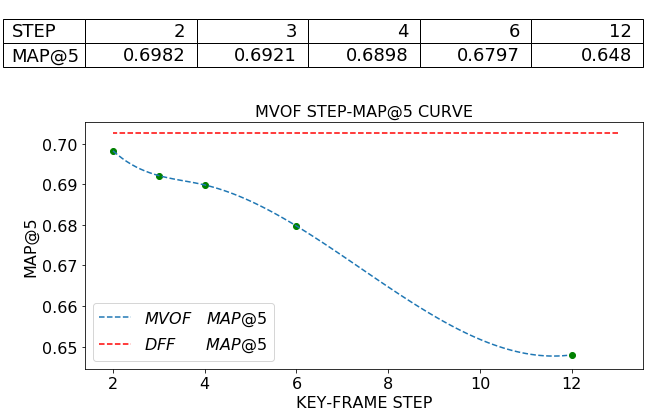

# Weekly Report 2019.09.09-2019.09.15

>   Jingtun ZHANG

**WHERE WE ARE**:

## Work and Progress
2.    :disappointed_relieved: Result of Final Modified MVFF-Version3: MAP@5 = 0.6225, just approximate MVFF-Version2 with residual bind.

3.    :hammer_and_wrench: : Data Preparation for V4: extracting TLV1-flow from dataset: Too slow to use, replaced by DFF-FlowNet flow extraction: Just for comparation with motion vector: DFF in training now

4.    :confused: : MVOF Step-MAP@5 Curve:

      

5.    :book: Learnning of Quantum Programming: Reading 《Programming Quantum Computers: Essential Algorithms and Code Samples》 and learnning QCEngine program 

      [Reading Note](https://github.com/OrdinaryCrazy/ustcnotebook/blob/master/Quantum/note.pdf)
